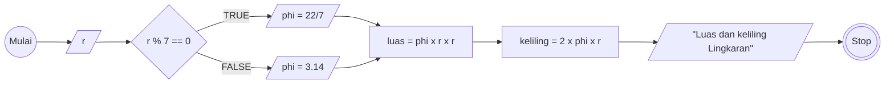

# Algoritma MiniTask - Membuat Algoritma Menghitung Luas dan Keliling Lingkaran

1. Mulai
2. Masukkan jari-jari sebagai 'r'
3. Jika 'r'' habis dibagi 7, maka gunakan 'phi' sebagai 22/7
4. Jika tidak gunakan 'phi sebagai 3.14
5. Hitung luas dengan 'phi' dikali r kuadrat
6. Hitung keliling dengan '2 dikali phi' dikali r
7. Tampilkan luas dan keliling lingkaran
8. Selesai

## FLowchart

