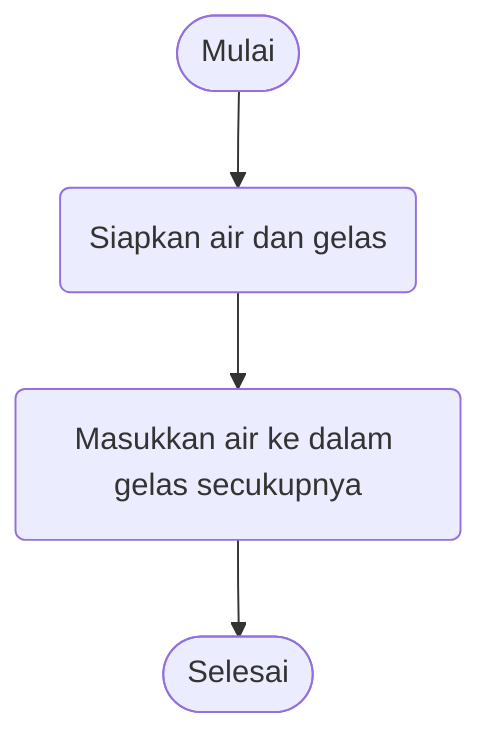

# Algoritma - Minitask
## Membuat algoritma memindahkan air di dalam gelas (gelas teh dan gelas kopi)

1. Mulai
2. Siapkan gelas kosong sebagai cadangan 
3. Masukkan air ke dalam gelas secukupnya
4. Selesai

Algoritma penyelesaian
1. Mulai
2. Siapkan gelas kosong sebagai cadangan
3. Tuangkan gelas yang berisi teh ke gelas cadangan
5. Tuangkan gelas yang berisi kopi ke awalnya di pakai teh
6. Tuangkan isi gelas cadangan ke gelas yang awalnya berisi koppi
7. Selesai

Membuat Algoritma menentukan bilangan ganjil atau genap