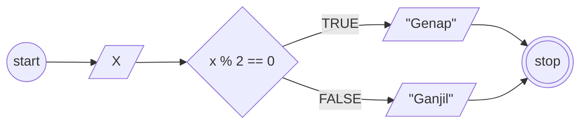
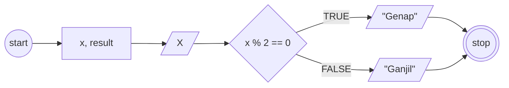

## MiniTask Algoritma Menentukan Bilangan Ganjil dan Genap

1. Mulai
2. Input Angka 'X'
3. Apakah angka 'X' dibagi 2 hasilnya 0?, maka angka 'X' bilangan genap.
4. Jika tidak, maka angka 'X' tersebut bilangan ganjil
5. Selesai

## Flowchart


```pseudocode
DECLARE X: INTEGER

INPUT X

IF X % == 0 THEN
    OUTPUT <- "Bilangan Genap"
ELSE
    OUTPUT <- "Bilangan Ganjil"
END IF

```

```pseudocode
DECLARE X: INTEGER
DECLARE RESULT: STRING

INPUT X

IF X % == 0 THEN
    RESULT <- "Genap"
ELSE
    RESULT <- "Ganjil"
END IF

OUTPUT "Bilangan ", RESULT

```


