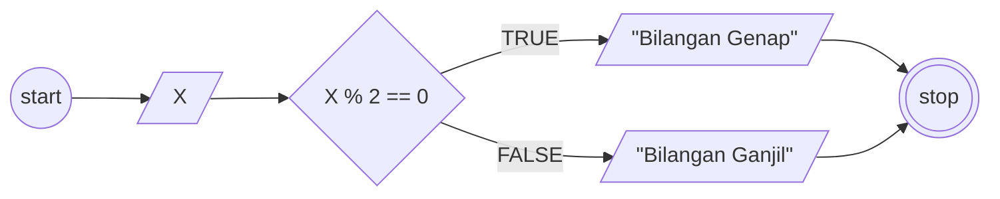
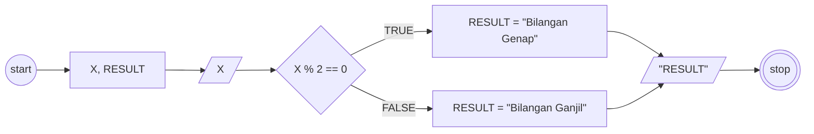

## MiniTask Algoritma Menentukan Bilangan Ganjil dan Genap

1. Mulai
2. Input angka 'X'
3. Jika angka 'X' dibagi 2 hasil sisa baginya 0, Maka angka 'X' tersebut bilangan genap.
4. Jika tidak, maka angka 'X' tersebut bilangan ganjil
5. Selesai

## Flowchart 1

## Psuedocode 1
```pseudocode
DECLARE X: INTEGER

INPUT X

IF X MOD 2 == 0 THEN
    OUTPUT "Bilangan Genap"
ELSE
    OUTPUT "Bilangan Ganjil"
ENDIF

```
## Flowchart 2

## Psuedocode 2
```pseudocode
DECLARE X: INTEGER
DECLARE RESULT: STRING

INPUT X

IF X MOD 2 == 0 THEN
    RESULT <- "Bilangan Genap"
ELSE
    RESULT <- "Bilangan Ganjil"
ENDIF

OUTPUT RESULT

```


