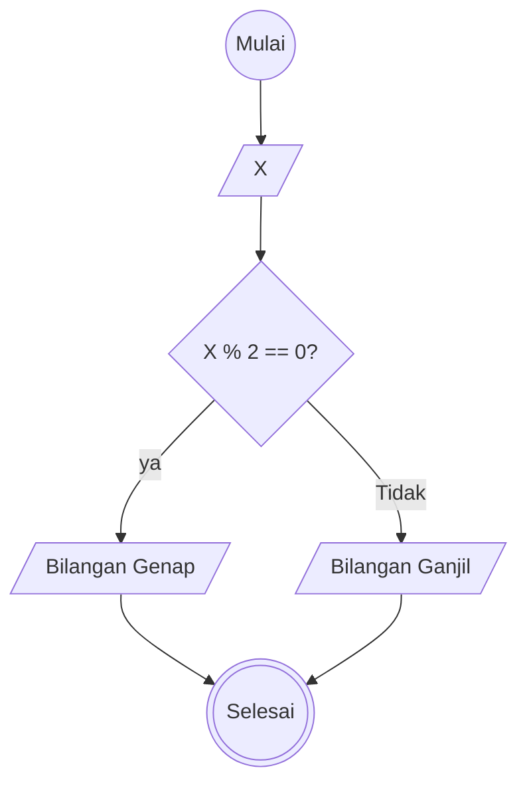

## MiniTask Algoritma Menentukan Bilangan Ganjil dan Genap

1. Mulai
2. Input Angka 'X'
3. Apabila angka 'X' dibagi 2 hasilnya 0?, maka angka 'X' bilangan genap.
4. Jika tidak, maka angka 'X' bilangan ganjil
5. Selesai

## Flowchart

